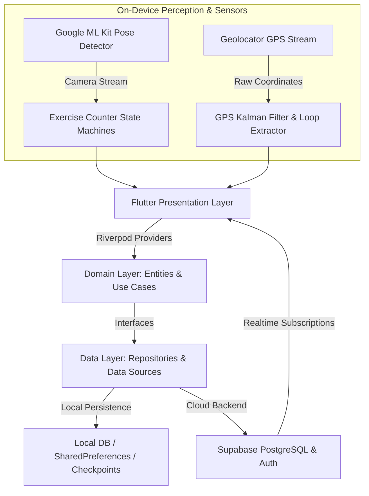

# AWAKEN: Comprehensive Technical & Product Documentation

> **Project Name**: Awaken  
> **Repository Path**: `lib/`  
> **Platform**: Flutter (iOS & Android)  
> **Architecture**: Clean Architecture + Feature-First (Data, Domain, Presentation)  
> **State Management**: Flutter Riverpod (AsyncNotifier, StateNotifier, Code Generator)  
> **Primary Backend**: Supabase (Auth, Postgres, Realtime, Cloud Functions)  
> **Machine Learning**: Google ML Kit Pose Detection (On-Device Skeleton Tracking)  
> **Map Engine**: `flutter_map` + `vector_map_tiles` (OpenFreeMap Vector Tiles with Cyberpunk HUD Styling)  

---

## 1. Executive Summary & Project Overview

**Awaken** is a gamified Cyberpunk-themed Flutter mobile application that completely redefines the morning wake-up experience and daily movement habits. It combines two core mechanics:

1. **Movement-Verified Physical Alarms ("Wake-Up Tax")**: Eliminates snooze functionality by requiring users to perform camera-verified physical exercises (squats, push-ups, jumping jacks, or high knees) in front of their device's camera. Exercise form, repetition count, joint angles, and body positioning are tracked live on-device using **Google ML Kit Pose Detection**.
2. **Geo-Gaming Territory Control ("Turf Wars")**: Transforms outdoor running and walking into a real-world location-based territory conquest game. Users run closed geographic loops in the physical world to capture, own, and defend land polygons on a dark HUD vector map, complete with **Fog of War**, **Bounty Zones**, **Territory Decay**, and real-time **Nemesis tracking**.

### Key Value Propositions
- **Anti-Snooze Guarantee**: The alarm audio and vibration loop cannot be dismissed via simple UI taps, swipes, or phone shaking. Disarming requires verified movement reps. If the user moves out of camera frame, the alarm volume ramps up aggressively.
- **Social Accountability & Squad Taxes**: Alarms can be synced across Squads. If a user misses or delays an alarm window, an automatic bailout penalty applies, increasing their required reps and levying squad taxes.
- **Real-Time GPS Loop-Closure Capture**: Run paths are continuously filtered via a position Kalman Filter. When a user runs a closed loop and returns near their starting anchor point, the enclosed geographic area is calculated and registered as captured territory.
- **Cyberpunk HUD Aesthetic**: High-contrast dark design system (`#09090B` obsidian background) featuring custom neon theme unlocks (**Cyan**, **Magenta**, **Acid Green**, **Mono White**), skeleton wireframe painters, dynamic scan lines, and glassmorphic stats cards.

---

## 2. Architecture & Technology Stack



### Core Technology Stack

| Layer / Subsystem | Technology Used | Package / Library | Description |
| :--- | :--- | :--- | :--- |
| **Framework** | Flutter / Dart | `flutter` | Cross-platform mobile runtime (iOS & Android). |
| **State Management** | Riverpod | `flutter_riverpod`, `riverpod_annotation` | Reactive dependency injection and state management. |
| **Routing** | GoRouter | `go_router` | Stateful shell navigation with indexed stacks & deep linking. |
| **Computer Vision** | Google ML Kit | `google_mlkit_pose_detection` | 33 3D skeletal landmark estimation at ~15-30 FPS. |
| **Backend & Auth** | Supabase | `supabase_flutter`, `google_sign_in` | PostgreSQL database, Row Level Security (RLS), OAuth. |
| **Maps & Rendering** | OpenFreeMap / Flutter Map | `flutter_map`, `vector_map_tiles`, `latlong2` | High-performance vector tile rendering, offline fallback. |
| **Geo Computation** | Turf & Geodesy | `turf` (ported to Dart), `geolocator` | Polygon intersection, area calculations, Haversine distance. |
| **Notifications** | Local & FCM | `flutter_local_notifications`, `firebase_messaging` | Timezone-aware exact alarm scheduling & real-time push pings. |
| **Media & Audio** | Audio & Haptics | `audioplayers`, `vibration`, `wakelock_plus` | Looping alarm audio, haptic pulses, preventing screen lock. |

### Directory Structure & Clean Architecture

```
lib/
├── app.dart                                # Root MaterialApp widget & lifecycle listener
├── main.dart                               # Entry point, timezone init, Supabase boot
├── core/
│   ├── constants/                          # Global numeric constants & configuration
│   ├── router/                             # GoRouter routes, shell scaffold, bottom nav
│   ├── services/                           # Platform services (audio, vibration, FCM, decay)
│   ├── theme/                              # Design tokens, typography, HUD theme extensions
│   └── utils/                              # Stream cancellation handlers & helpers
└── features/
    ├── alarm/                              # Computer-vision movement alarm feature
    │   ├── data/                           # Local & Supabase alarm datasources & models
    │   ├── domain/                         # Exercise counter state machines & entities
    │   └── presentation/                   # Active alarm screen, pose overlay, HUD widgets
    ├── auth/                               # Supabase auth, Google sign-in, user profile
    ├── dashboard/                          # Cyberpunk home HUD, stat cards, HUD theme picker
    ├── onboarding/                         # 3-step carousel & permission setup
    ├── sessions/                           # Exercise & run session logging & sync engine
    ├── shell/                              # Main bottom navigation shell container
    ├── success/                            # Alarm disarm & run completion celebration screen
    └── territory/                          # GPS run tracking, vector map, bounty & fog of war
```

---

## 3. Comprehensive Feature Breakdown

### Feature 1: Movement-Verified Active Alarm & Exercise Engine
The active alarm feature (`lib/features/alarm/presentation/screens/active_alarm_screen.dart`) locks the screen when triggered. To turn off the alarm sound and dismiss the screen, the user must position their phone against an object or on a stand and perform camera-verified exercise repetitions.

- **Supported Exercise Modes**:
  1. **Squats** (`SquatCounterService`): Tracks hip-to-knee gap relative to torso height. Enforces knee angle $< 100^\circ$ for bottom depth, standing angle $> 150^\circ$ for completion, and checks shoulder tilt to prevent leaning form.
  2. **Push-ups** (`PushUpCounterService`): Measures elbow flex angle (shoulder-elbow-wrist) and chest proximity to ground landmarks.
  3. **Jumping Jacks** (`JumpingJackCounterService`): Monitors hand elevation above head level synchronized with lateral leg spread angle.
  4. **High Knees** (`HighKneesCounterService`): Enforces hip-to-knee height ratio for alternating leg lifts.
  5. **Random Mode**: Selects a dynamic exercise type when the alarm fires to keep workouts unpredictable.
- **Form Calibration & EMA Filtering**:
  - Uses single-pass Exponential Moving Average (`EmaFilter`, $\alpha=0.35$) to smooth joint noise.
  - Requires 8 consecutive standing calibration frames (`requiredCalibrationFrames`) to establish base body metrics before rep counting begins.
- **Out-of-Frame Penalty**:
  - If the user steps out of frame for $>5$ consecutive frames (~330ms), the UI displays a warning banner ("STEP BACK — FULL BODY IN FRAME") and triggers a volume ramp-up timer (`volumeRampStep = 0.15` per tick).
- **Emergency Hold Hatch**:
  - A low-discoverability 10-second hold button (`_emergencyHoldDuration`) allows users to disarm the alarm without camera verification in emergencies, automatically applying a $2\times$ bailout penalty.

### Feature 2: Social Squad Alarms & Squad Taxes
Allows users to link alarms with friends or squad mates (`lib/features/alarm/presentation/widgets/squad_sheet.dart`).
- **Squad Code Sharing**: Users generate or join unique 6-character squad join codes.
- **Tax Reveal Stamp**: On alarm trigger, a dynamic stamp (`tax_reveal_stamp.dart`) displays current tax multipliers, squad penalties, and active squad members.
- **Squad Tax Rail**: Real-time progress bar (`squad_tax_rail.dart`) showing squad members' completion status during synchronized alarm triggers.
- **Bailout Penalty Logic**: Alarms left un-dismissed past the 2-hour window (`bailoutWindow`) are automatically flagged as bailed out, doubling required reps for the next session or charging squad taxes.

### Feature 3: GPS Territory Control & Geo-Gaming ("Turf Wars")
Converts outdoor runs into geographic conquest (`lib/features/territory/presentation/screens/territory_run_screen.dart`).
- **GPS Kalman Filtering**: Real-time positional Kalman filter (`GpsKalmanFilter`) smoothes raw GPS pings and eliminates jitter before feeding points to the loop tracker.
- **Loop Closure Algorithm**:
  - Evaluates live GPS points using `LoopClosureTracker`.
  - Enforces minimum exit distance ($50\text{ m}$), minimum segment distance ($150\text{ m}$), closure radius ($\le 50\text{ m}$), and minimum GPS points ($N \ge 6$).
- **Polygon Simplification & Capture**:
  - Applies Ramer-Douglas-Peucker (`rdp_simplifier.dart`) algorithm ($\epsilon = 3.0\text{ m}$) to simplify raw GPS tracks into clean polygons before cloud upload.
  - Computes enclosed area using Shoelace formula / Turf.js. Minimum valid loop area is $50\text{ m}^2$.
- **Anti-Cheat Speed Enforcement**:
  - Monitors a 6-ping rolling window (`speedRollingWindowSize`). If sustained speed exceeds $25\text{ km/h}$, the run is invalidated for vehicle usage.
- **Bounty Zones**: Dynamic high-value map zones (`BountyZoneEntity`) that grant $1.5\times - 3.0\times$ area or score multipliers when captured.
- **Fog of War**: Tile-based fog grid (`explored_cells_store.dart`) with resolution $\sim 70\text{ m}$ ($0.00065^\circ$). Unexplored map areas remain veiled until physically traversed.
- **Territory Decay**: Claimed territories decay after 7 days of inactivity (`territoryDecayGracePeriod`). Decay notifications alert users when land is at risk of reverting to unclaimed status.
- **Nemesis Tracking**: Identifies rival runners (`NemesisEntity`) who have captured adjacent territories or reclaimed user land.

### Feature 4: Cyberpunk HUD Design System & Themes
Dark-only futuristic aesthetic (`lib/core/theme/`):
- **Forced Dark Theme**: Absolute dark background (`AppColors.background = #09090B`), vibrant neon accents (`#4A9EFF` primary cyan, `#FF2A6D` destructive red).
- **Streak-Unlocked HUD Themes** (`HudTheme`):
  - **Cyan** (Default, unlocked at streak 0)
  - **Magenta** (Unlocked at streak 7)
  - **Acid Green** (Unlocked at streak 30)
  - **Mono White** (Unlocked at streak 90)
- **Visual Overlays**: Skeleton wireframe painter (`skeleton_wireframe.dart`), animated scanning line (`scan_line_animation.dart`), and custom vector map styling (`territory_map_style.dart`).

### Feature 5: Multi-Scoped Global & Regional Leaderboards
Ranks runners across multiple dimensions (`lib/features/territory/presentation/screens/territory_leaderboard_screen.dart`):
- **Filter Scopes**: Global, Regional/Nearby (uses device GPS centroid), and Squad-only.
- **Time Windows**: All-Time, Monthly, and Weekly.
- **Podium & Neighborhood View**: Top 3 custom podium cards with crowns + neighborhood window ($myRank \pm 5$) so users can easily see their immediate competitors. Tapping any rank row focuses the map on that user's territory.

### Feature 6: Offline Resilience & Session Sync Engine
Ensures zero data loss during connectivity drops (`lib/features/sessions/`):
- **Pending Session Queue**: Unsent exercise or run sessions are saved to encrypted local storage (`pending_session_queue.dart`).
- **Automatic Background Sync**: `SessionSyncService` automatically flushes pending sessions upon app resume or Supabase auth restoration.
- **Active Run Checkpoint Store**: Persists GPS run checkpoints to disk every 10 seconds so app crashes or OS memory kills during a run can be restored seamlessly on app restart.

---

## 4. Key Functions, Services & Data Models

### Key Services & Utility Functions

```dart
// 1. Joint Angle Calculation (lib/features/alarm/domain/services/joint_angle.dart)
// Uses numerically stable atan2(cross, dot) to calculate angles (0–180°) without acos clamping errors.
double JointAngle.between(Offset a, Offset vertex, Offset c)

// 2. Squat Form Processor (lib/features/alarm/domain/services/squat_counter_service.dart)
// Two-state machine evaluating knee angles, normalized depth ratio, and shoulder tilt.
SquatProcessResult SquatCounterService.processPose(Pose pose)

// 3. Loop Segment Extractor (lib/features/territory/domain/services/loop_segment_extractor.dart)
// Extracts all closed loops from a raw sequence of GPS pings during a run.
List<LoopSegmentEntity> LoopSegmentExtractor.extract(List<GeoPointEntity> points)

// 4. GPS Position Kalman Filter (lib/features/territory/domain/services/gps_kalman_filter.dart)
// Smoothes GPS lat/lng noise based on platform reported accuracy meters.
(double lat, double lng) GpsKalmanFilter.filter(double lat, double lng, double accuracyMeters)

// 5. Ramer-Douglas-Peucker Simplifier (lib/features/territory/domain/services/rdp_simplifier.dart)
// Reduces vertex count of GPS paths while preserving geometric polygon shape.
List<GeoPointEntity> RdpSimplifier.simplify(List<GeoPointEntity> points, double epsilonMeters)

// 6. Run Validation & Anti-Cheat (lib/features/territory/domain/services/run_validation_service.dart)
// Validates sustained speed cap (<= 25 km/h), min duration (2 min), and min distance (200 m).
RunOutcome RunValidationService.classify(...)
```

### Key Data Entities & Models

| Entity / Model | Path | Description |
| :--- | :--- | :--- |
| `AlarmEntity` | `lib/features/alarm/domain/entities/alarm_entity.dart` | Defines scheduled alarm time, exercise type, required reps, penalty multiplier, and active days. |
| `AppUser` | `lib/features/auth/domain/entities/app_user.dart` | User profile object containing Supabase ID, display name, avatar URL, streak count, and squad ID. |
| `TerritoryEntity` | `lib/features/territory/domain/entities/territory_entity.dart` | Represents a captured map polygon with area ($m^2$), boundary points, capture timestamp, and decay date. |
| `SessionEntity` | `lib/features/sessions/domain/entities/session_entity.dart` | Stores historical exercise or run session details (reps, duration, calories burned, sync state). |
| `BountyZoneEntity` | `lib/features/territory/domain/entities/bounty_zone_entity.dart` | Represents a high-reward map zone with centroid coordinates and score multiplier. |
| `LeaderboardEntryEntity` | `lib/features/territory/domain/entities/leaderboard_entry_entity.dart` | Formatted rank entry containing user stats, rank position, territory area, and badge tier. |

---

## 5. Screen & UI Walkthrough

### 1. Dashboard Screen (`DashboardScreen`)
- **Header**: Digital clock with second ticker, user avatar/auth badge, and notification icons.
- **System Banners**: Surfaces permissions requests (Exact Alarm Permission, Battery Optimization Exemption) and active Bailout Penalty warnings.
- **Armed Alarm Card**: High-contrast card showing next scheduled alarm, target exercise icon, countdown timer, and required rep count.
- **Streak Ring & Theme Selector**: Circular streak progress visualizer paired with the `HudThemePicker` to toggle unlocked color themes.
- **Stats Matrix**: Four grid cards displaying Reps Completed, Land Held ($km^2$), Active Streak, and Total Sessions.
- **Week Trend Chart**: Bar graph visualizing daily exercise rep volume over the past 7 days.
- **Squad & Nemesis Cards**: Quick access to squad member activity and rival territory alerts.

```
+--------------------------------------------------+
| 07:30 AM                  [Avatar] [Settings]    |
| MON, JUL 23                                      |
+--------------------------------------------------+
| [!] EXACT ALARM PERMISSION REQUIRED     [GRANT]  |
+--------------------------------------------------+
| NEXT ALARM                                       |
| 06:30 AM (in 22h 59m)                            |
| Target: 10 SQUATS | Penalty: 1x                  |
+--------------------------------------------------+
|  ( 12 STREAK )    HUD Theme: [Cyan] [Magenta]    |
+--------------------------------------------------+
| [ Reps: 140 ]           [ Territory: 1.2 km² ]   |
| [ Streak: 12d ]         [ Sessions: 18 ]         |
+--------------------------------------------------+
| WEEKLY TREND                                     |
| ||  ||  ||  ||  ||  ||  ||                       |
| M   T   W   T   F   S   S                        |
+--------------------------------------------------+
```

### 2. Active Alarm Screen (`ActiveAlarmScreen`)
- **Camera Feed & HUD Overlay**: Live camera preview with cyan/magenta scanning line animation and real-time skeleton joint wireframe.
- **Live Cue & Form Guidance**: Text bar displaying real-time feedback ("STEP BACK", "GO DEEPER", "PERFECT REP").
- **Rep Counter Display**: Large digital rep counter showing completed vs. required reps ($3 / 10$).
- **Squad Tax Rail**: Vertical/horizontal status rail showing live completion status of squad members.
- **Tax Reveal Stamp**: Initial animated overlay displaying active penalties and challenge conditions.
- **Emergency Release**: Bottom long-press progress bar requiring 10 seconds of continuous hold to disarm with penalty.

### 3. Territory Run Screen (`TerritoryRunScreen`)
- **Interactive Vector Map**: Dark custom-styled map with tile caching, user location marker, and direction cone.
- **Map Layers**: Polygon layer showing claimed user land in neon glow, enemy land in amber/red, Bounty Zone circles, and Fog of War veil.
- **Run Stats Sheet**: Floating glassmorphic HUD showing active duration ($00:14:22$), distance ($2.45\text{ km}$), speed ($11.2\text{ km/h}$), and loop closure progress bar.
- **Run Controls**: Ergonomic thumb-zone buttons for Start, Pause, Resume, and Finish Claim.

### 4. Territory Leaderboard Screen (`TerritoryLeaderboardScreen`)
- **Scope & Time Selectors**: Segmented pills for Global / Nearby / Squad and All-Time / Monthly / Weekly.
- **Top 3 Podium**: Tiered 1st, 2nd, and 3rd place visual cards with crowns, user avatars, and total area conquered.
- **Rank List**: Smooth list view with highlighted current user row, rank numbers, land area ($km^2$), and quick map-jump buttons.

---

## 6. Comprehensive User Stories & Acceptance Criteria

### Epic 1: Movement-Verified Waking

#### User Story 1.1: Camera-Verified Squat Disarm
> **As a** heavy sleeper,  
> **I want** the alarm to require physical squats verified by the front camera,  
> **So that** I am forced to get out of bed and physically move before the alarm stops.
- **Acceptance Criteria**:
  1. Alarm fires audio and vibration loop at scheduled time.
  2. Active alarm screen launches front camera automatically.
  3. ML Kit pose detector tracks hip and knee joints.
  4. Rep increments only when knee angle drops below $100^\circ$ and returns above $150^\circ$ with depth ratio $\ge 0.6$.
  5. Alarm audio stops only when `completedReps == requiredReps`.

#### User Story 1.2: Multi-Exercise Selection
> **As a** user,  
> **I want** to choose between Squats, Push-ups, Jumping Jacks, High Knees, or Random mode,  
> **So that** my wake-up routine remains engaging and varied.
- **Acceptance Criteria**:
  1. Alarm setup screen permits choosing any of the 4 core exercises or Random mode.
  2. When set to Random mode, an exercise type is selected dynamically at fire time.
  3. Active alarm HUD adjusts scanning overlays and text cues to match the selected exercise.

#### User Story 1.3: Out-of-Frame Penalty & Volume Ramp
> **As a** system,  
> **I want** to detect when the user leaves the camera view during an active alarm,  
> **So that** users cannot cheat by leaving the phone unattended.
- **Acceptance Criteria**:
  1. If skeletal landmarks are missing for $>5$ consecutive frames, trigger out-of-frame state.
  2. UI displays "STEP BACK — FULL BODY IN FRAME" warning banner.
  3. Alarm audio volume increases by $0.15$ every 8 seconds until full frame is restored.

---

### Epic 2: Social Squad Alarms & Wake-Up Taxes

#### User Story 2.1: Squad Alarm Synchronization
> **As a** squad leader,  
> **I want** to invite friends to a shared alarm squad via a 6-character code,  
> **So that** we all wake up at the same time and hold each other accountable.
- **Acceptance Criteria**:
  1. User can create or join a squad using a unique code.
  2. Alarms created under squad mode sync scheduled times across all members via Supabase.
  3. Squad members receive push pings when squad mates trigger or complete their alarm.

#### User Story 2.2: Bailout Penalties & Squad Taxing
> **As a** squad member,  
> **I want** users who snooze or miss their alarm window to pay a rep penalty or squad tax,  
> **So that** there are real social consequences for missing wake-up times.
- **Acceptance Criteria**:
  1. If an alarm goes un-dismissed for $>2$ hours, `AlarmBailoutService` marks the session as bailed out.
  2. Next alarm session required reps are multiplied by $2\times$.
  3. Squad members view the tax reveal stamp on their next alarm entry.

---

### Epic 3: GPS Territory Capture & Geo-Gaming

#### User Story 3.1: Closed-Loop Polygon Land Capture
> **As a** runner,  
> **I want** to capture map territory by running a closed geographic loop,  
> **So that** I can claim physical real estate on the map.
- **Acceptance Criteria**:
  1. Active run stream records filtered GPS pings.
  2. When runner exits $50\text{ m}$ radius and returns within $50\text{ m}$ of anchor after traveling $\ge 150\text{ m}$, loop closure triggers.
  3. RDP algorithm simplifies path into polygon ($\epsilon = 3.0\text{ m}$).
  4. Enclosed area (> $50\text{ m}^2$) is awarded to user and highlighted in neon on the vector map.

#### User Story 3.2: Anti-Cheat Speed & Vehicle Protection
> **As a** fair player,  
> **I want** speed-cheating in cars or bikes to be invalidated,  
> **So that** territory can only be earned through legitimate walking or running.
- **Acceptance Criteria**:
  1. Evaluates rolling 6-ping window during active runs.
  2. If sustained speed exceeds $25\text{ km/h}$, run status changes to `invalidatedSpeedCap`.
  3. Captured loops from invalidated runs are discarded without area allocation.

#### User Story 3.3: Fog of War Exploration
> **As an** explorer,  
> **I want** unvisited map areas covered in Fog of War,  
> **So that** I feel rewarded for exploring new streets and neighborhoods.
- **Acceptance Criteria**:
  1. Map displays dark semi-transparent fog over unvisited grid cells ($\sim 70\text{ m}$ resolution).
  2. Real-time GPS path reveals underlying vector map as user moves.
  3. Explored cells persist locally and sync to Supabase.

#### User Story 3.4: Territory Decay & Defence
> **As a** competitive runner,  
> **I want** inactive territories to decay after 7 days,  
> **So that** the map stays dynamic and contested.
- **Acceptance Criteria**:
  1. Territories unvisited for $>7$ days enter decay grace status.
  2. Local decay notification alerts user to run through territory to refresh ownership.
  3. Expired territories revert to unclaimed state.

---

### Epic 4: Cyberpunk HUD & Customization

#### User Story 4.1: Dynamic Theme Unlocks
> **As a** dedicated user,  
> **I want** to unlock new HUD themes by building long wake-up streaks,  
> **So that** I can customize my app interface as a badge of honor.
- **Acceptance Criteria**:
  1. Streak 0 unlocks Cyan theme.
  2. Streak 7 unlocks Magenta theme.
  3. Streak 30 unlocks Acid Green theme.
  4. Streak 90 unlocks Mono White theme.
  5. Selected theme updates primary colors, skeleton wireframes, map accents, and scan lines app-wide.

---

## 7. Verification & Testing Checklist

- [x] **Unit & Domain Tests**:
  - `JointAngle` atan2 geometry verification.
  - `SquatCounterService`, `PushUpCounterService`, `JumpingJackCounterService` state machine transitions.
  - `LoopSegmentExtractor` loop closure detection.
  - `RdpSimplifier` vertex reduction accuracy.
  - `GpsKalmanFilter` noise reduction logic.
  - `RunValidationService` speed cap and minimum duration/distance checks.
- [x] **Integration & State Tests**:
  - Riverpod provider lifecycle & override sanity.
  - Supabase Auth & RLS table access.
  - Offline session queue persistence & background flush.
- [x] **Hardware & Platform Integration**:
  - ML Kit Pose Detection camera frame pipeline performance (~15-30 FPS).
  - Geolocator background location permissions & battery drain optimization.
  - Timezone-aware local notifications & exact alarm permission handling.
